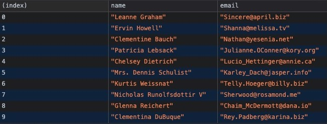

# Random Tips and Code Snippets
This is a collection of random tips and code snippets.

## JavaScript
### `console.table()`
Prints out the objects and their selected data in table form, in console.
```js
async function getUsers() {
    let response = await fetch('https://jsonplaceholder.typicode.com/users')
    let data = await response.json()
    
    console.table(data, ['name', 'email'])
}

getUsers()
```


## BeautifulSoup

### Finding element based on a tag and its text
```python
soup.find(lambda tag: tag.name == 'a' and 'edit' in tag.text) 
```

### Finding element based on an attribute containing a partial string
```python
for element in soup.select('div[class*="listing-col-"]'):
    print(element.get_text())
```

## Git

### `git stash` & `git stash pop`
* switching to another branch requires that you commit your work
* `git stash` can be used to temporarily put away unfinished work
* `git stash pop` to continue where you left off
    * `git stash pop 2` for a specifc index
